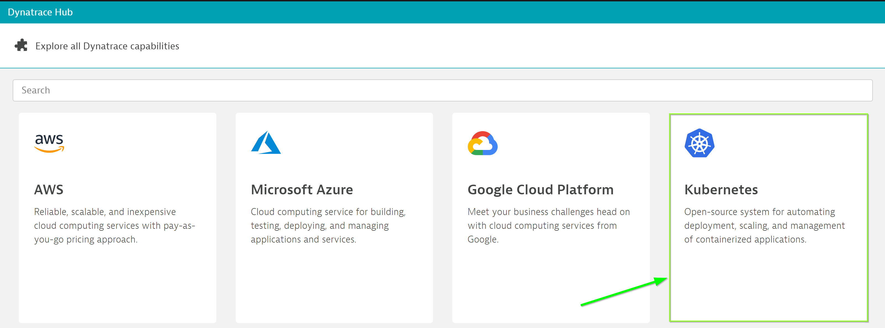

summary: Third Party Integration - Prometheus
id: K8s-Prometheus
categories: STEP
environments: steplabs
status: Published
author: Nikhil Goenka
feedback link: mailto:d1-apac@dynatrace.com
analytics account:
# Install Dynatrace OneAgent Operator

## Pre-requisites

Within your tenant, navigate to Deploy Dynatrace > Kubernetes


Further, click on "Monitor Kubernetes". Now, from the drop-down, select the following config values:  

Now, click on  for "PaaS Token", select "Create a new PaaS token" and click to open in a new window. Once navigated to the page, click on "Generate Token" to create a token.  

Give an appropriate name say "PaaS-k8s" and copy the token value in a temporary file.


Similarly, for "API Token" select "Create a new API token" and click to open in a new window.  


> *NOTE*: When selecting the permissions, make sure you have the Access problem and event feed, metrics, and topology under "API v1" setting enabled for the API token.  

## Oneagent Operator Installation

Dynatrace support multiple deployment strategies to install oneAgent Operator. We will use Helm approach.  

Use the following command to install Helm 3.
`sudo snap install helm --classic`

1. Once helm is installed, add Dynatrace OneAgent Helm repository as below:

```bash
helm repo add dynatrace https://raw.githubusercontent.com/Dynatrace/helm-charts/master/repos/stable  
```
  
2. Create a namespace *dynatrace* which will hold the operator deployment and it's dependencies. To create the namespace, use the command as below:

```bash
kubectl create namespace dynatrace
```

3. Now, create a values.yml with the text as below:

```bash
platform: "kubernetes"
operator:
  image: ""
oneagent:
  name: "oneagent"
  apiUrl: "https://ENVIRONMENTID.live.dynatrace.com/api"
  image: ""
  args:
    - --set-app-log-content-access=true
  env: {}
  nodeSelector: {}
  labels: {}
  skipCertCheck: false
  disableAgentUpdate: false
  enableIstio: false
  dnsPolicy: ""
  resources: {}
  waitReadySeconds: null
  priorityClassName: ""
  serviceAccountName: ""
  proxy: ""
  trustedCAs: ""
secret:
  apiToken: "DYNATRACE_API_TOKEN"
  paasToken: "PLATFORM_AS_A_SERVICE_TOKEN"
```

Replace the apiToken and paasToken configurables with the values retrieved earlier and set apiURL to point to your tenant.  

For SaaS, configure apiUrl as https://<ENVIRONMENTID>.live.dynatrace.com/api , where ENVIRONMENTID is your tenant-id
For Managed cluster, use apiUrl as https://<my-server>/io/<ENVIRONMENTID>/api, where my-server is the domain name/ip of your server and ENVIRONMENTID is your managed environment

Once replaced, save the file.

4. Lastly, run the below command to apply the YAML

```bash
helm install dynatrace-oneagent-operator dynatrace/dynatrace-oneagent-operator -n dynatrace --values values.yaml
```

If succesful, you will get a prompt similar to the below and you will see the host appearing when you click on **Show Deployment status**

```bash
NAME: dynatrace-oneagent-operator
LAST DEPLOYED: Wed Mar 03 02:01:30 2021
NAMESPACE: dynatrace
STATUS: deployed
REVISION: 1
TEST SUITE: None
NOTES:
Thank you for installing dynatrace-oneagent-operator.

Your release is named dynatrace-oneagent-operator.
```

# Start the sample-application

To start the sample-application pods, navigate to `/home/ubuntu/k8s` folder.  

Under that folder you would be able to view the yaml files for front-end and mongodb deployment. In order to deploy the services and deployment, run the following commands:  

`kubectl apply -n dynatrace -f app-deployment.yaml`  
`kubectl apply -n dynatrace -f mongo-deployment.yaml`  
`kubectl apply -n dynatrace -f mongo-service.yaml`  
`kubectl apply -n dynatrace -f app-service.yaml`   

This would create the deployment and services for all components for the application.

Now, in order to access the application from outside the k8s cluster, run the below command:  

`kubectl expose deployment/app --type=NodePort --name=model-app -n dynatrace --port 30005`  

This would create a service which will be accessible from outside the cluster using **<Instance-ip>:30005**.

Verify the service is up and running as expected using command below. <br>
`kubectl describe service model-app -n dynatrace`


### ⚠️ Troubleshooting steps

Negative
: To **check status of pods**, run command below. You should get a **Running** as a return.<br>
`kubectl get pods -n dynatrace`

Negative
: To **check the logs**, run command below.<br>
`kubectl logs -f deployment/dynatrace-oneagent-operator -n dynatrace`

Negative
: To **delete secrets**, run command below. You might have included a wrong secret previously. <br>
`kubectl delete secret --all -n dynatrace`

Negative
: To **delete all pods**, run command below. This will cycle through the pods and you will have new pod instances.<br>
`kubectl delete --all pods -n dynatrace`

Negative
: To **check status of deployments**, run command below. You should get a **Running** as a return.<br>
`kubectl get deployments -n dynatrace`

Negative
: To **check status of services**, run command below. You should get a **Running** as a return.<br>
`kubectl get deployments -n dynatrace`

Negative
: To **delete a service**, run command below.<br>
`kubectl delete service <serviceName> -n dynatrace`

Negative
: Official troubleshooting page could be found [here](https://www.dynatrace.com/support/help/technology-support/cloud-platforms/google-cloud-platform/google-kubernetes-engine/installation-and-operation/full-stack/troubleshoot-oneagent-on-google-kubernetes-engine/)
  
# Accessing the application

Now, register an user on the application at http://<IP-address>:30005/register page with the following details:
**Name**: Guest User
**E-Mail Address**: guestuser@mybank.com
**Password**: GuestUser12@
**Name**: 123456789


As you have completed registering yourself on the application, now login into the app from http://<my-IP>:30005/login with the credentials as below:

**E-Mail Address**: guestuser@mybank.com  
**Password**: GuestUser12@

# Setting up Kubernetes Integration

In order to integrate kubernetes, you are required to install Environment activeGate.

## Setup Enviornment activeGate

1. Within Dynatrace, click on Deploy Hub on the left menu
2. Click on Activegate at the bottom of the page
3. Click on Install Activegate > Linux
4. Copy Step 2 from Dynatrace and paste into your shell terminal.
5. Copy Step 4 from Dynatrace and append "sudo" (installing as root) onto shell terminal.  

  
  

Once completed, you should see Activegate under Deployment Status.  

  

### Create a Service Account and Cluster role

Create a service account and cluster role for accessing the Kubernetes API. This creates the bearer token necessary to authenticate in the Kubernetes API. Use the following snippet in your shell terminal.

```bash
kubectl apply -f https://www.dynatrace.com/support/help/codefiles/kubernetes/kubernetes-monitoring-service-account.yaml
```  

### Setup your Kubernetes Integration

Go to **Settings -> Cloud and Virtualization -> Kubernetes -> Connect new cluster**

### Get the Kubernetes API URL

Enter the below command and copy it for the **Kubernetes API URL**.

```bash
kubectl config view --minify -o jsonpath='{.clusters[0].cluster.server}'
```

### Get the Bearer Token

Enter the below command and copy it for the **Kubernetes Bearer Token**.

```bash
kubectl get secret $(kubectl get sa dynatrace-monitoring -o jsonpath='{.secrets[0].name}' -n dynatrace) -o jsonpath='{.data.token}' -n dynatrace | base64 --decode
```

### Connect your Kubernetes to Dynatrace

1. Go to **Settings > Cloud and virtualization > Kubernetes.**  
2. Select Connect new cluster.  
3. Provide a Name say "K8s-cluster", Kubernetes API URL (retrieved from "Get the Kubernetes API URL" step above), and the Bearer token (retrieved from "Get the Bearer Token" step above) for the Kubernetes cluster.  

> Note: Make sure you have enabled the configurables as below:
  

Once successfully connected, click on Kubernetes on the left menu and explore the Kubernetes UI.  

  

Also, there would be a dashboard already in your tenant to view the cluster view available at **Dashboards** on the left menu  

  

# Installing Prometheus exporter

Let us install prometheus on the Kubernetes cluster so that it can monitor the application pods using node-exporter and mangodb-exporter.  

Within EC2, execute the below commands:  

```sh
$ helm repo add prometheus-community https://prometheus-community.github.io/helm-charts  

$ helm repo update  

$ helm install prometheus-node-exporter prometheus-community/prometheus-node-exporter  

```

Once executed, prometheus-node-exporter along with other prometheus pods would be installed in default namespace automatically on your kubernetes cluster.

Positive
: To view the installed pods, execute `kubectl get pods`  

## Install mongodb-exporter  

To install mongodb-exporter, first add helm repository of mongodb-exporter by running command `https://github.com/prometheus-community/helm-charts/tree/main/charts/prometheus-mongodb-exporter`  

  
This would add the mongodb-exporter to your helm repo. We will require the Cluster-IP of mongodb service to configure prometheus so that it scrapes metrics from mongodb-exporter, run `kubectl describe service -n dynatrace mongo`  

  

  

Note and keep the clusterIP handy, we will need this while setting up the mongodb-exporter.  

```bash
helm3 install prometheus-mongo prometheus-community/prometheus-mongodb-exporter --set mongodb.uri=mongodb://cluster-ip:27017 --set-string podAnnotations."prometheus\.io/scrape"=true --set-string podAnnotations."prometheus\.io/port"=9108
```

This would run the mongodb-exporter pod in your kubernetes cluster. You should be able to view all the prometheus pods running in your cluster similar to below by executing:  
`kubectl get pods`  

  
Lastly, annotate the mongodb-exporter or/and node-exporter so that oneagent running on the cluster push promtheus metrics to dynatrace tenant.  
  
  
<br/><br/> 
Copy the mongodb-exporter pod details and annotate them using command:  
`kubectl annotate pod mongodb-exporter metrics.dynatrace.com/scrape=true --namespace=default`  
`kubectl annotate pod mongodb-exporter metrics.dynatrace.com/port=9216 --namespace=default`  

**NOTE**: Replace the mongodb-exporter string with the actual pod name determined using earlier command.  

<br/><br/>
Positive  
: You can view prometheus target information by port-forwarding the prometheus service and accessing prometheus UI 
`kubectl port-forward  service/prometheus-operated --address 0.0.0.0 9090:9090 & `  

Open the URL - "http://EC2-IP:9090/targets" to view the running exporters:  

  
   
## Metrics  
Once the pods are annotated, prometheus metrics would be available in *Metrics* screen
  
  


Positive  
: Should you want to limit the metrics being pushed by Prometheus exporter to Dynatrace, annotate the below json to the exporter pod:  
  
```json  
metrics.dynatrace.com/filter: |
    {
      "mode": "include",
      "names": [
          "metrics-name-1",
          "metrics-name-2",
          ]
    }

```  
Replace the metrics-name-1, metrics-name-2, etc with the appropriate name which will ascertain only the configured metrics are pushed through.  For annotating the pod, use command `kubectl edit pod <pod_name> -n namespace`
  
  
# Why push the metrics in Dynatrace?  
  Once the metrics are being pushed in Dynatrace, DAVIS AI engine would start digesting the information and identifying the baseline for these metrics. You can setup custom alerts (with auto-detective baseline) so that whenever Dynatrace DAVIS engine deems to be an issue, it will fire an alert.
  
## Populate Baseline using Synthetic Monitors  
Dynatrace uses real-time traffic to generate baseline for the pivotal parameters like response-time, error-rate, throughput, etc. for service/application. So, in order to generate some traffic, let us setup HTTP monitor which thereby would result DAVIS to generate baseline.  

Within Dynatrace-tenant, navigate to "Synthetic" and click on "Create synthetic monitor". Further, click on "Create an HTTP monitor"
  

Further, create the http monitor with the following configuration:  
1. Name of HTTP monitor : Prometheus-setup-1  
2. Request type: HTTP  
3. HTTP Request URL: <AWS-IP>:30005/login - Replace the AWS-IP with your machine IP  
4. Name: Sample-app  
  

HTTP monitors can be scheduled to run from Dynatrace's private synthetic location to fire HTTP request at the scheduled time. So, configure the HTTP monitor to run every **1 minute** from any **two** available locations.  
  

Once configured, Dynatrace would fire the http-requests on the service, thereby, generating traffic. To view the generated requests, navigate to **Transactions & Services > node-bank** service. The traffic will be used by DAVIS to determine the baseline of the service or the requests.

## Setup custom alert (with auto-detective baseline)
Setup a custom alert with auto-detective baseline so that the AI engine would determine the threshold after studing the trend and behavior of those specific metrics. To setup custom alert, navigate to "Settings" > "Anomaly detection" > "Custom events for alerting".  
  

All the metrics which are pushed into Dynatrace are available in the metrics drop-down. Select the metrics that you would like to set custom event for say `mongodb_network_metrics_num_requests_total.count`. 
  
  


Further, under **Monitoring strategy** select the following configuration:  
1. Alert-type: Auto-adaptive baseline  
2. Configure to be alerted if the metric is above the baseline for **1** mins during **3** minutes window**  
3. Make sure to select **Alert** in the drop down to be alerted should the metric go beyond the baseline.  

  

Positive
: Dynatrace would indicate the number of alerts you would have received as per the baseline and the configuration under "Alert Preview" section so that you can fine-tune the settings in order to avoid alert storm.  

## Trigger an alert
Within Ec2 instance, navigate to `/home/ubuntu/k8s` folder. Under that folder there would be a file named "simulate-alert.py". Run the file as follows:  
```bash
python3.8 simulate-alert.py <AWS-IP> <port-number> 
```  

NOTE: Replace the AWS-IP with your public-ip and port-number with the NodePort where the application is listening.  

Once the script is executed, it would fire multiple requests parallely on the application. This will trigger an alert similar to the below:  
  
